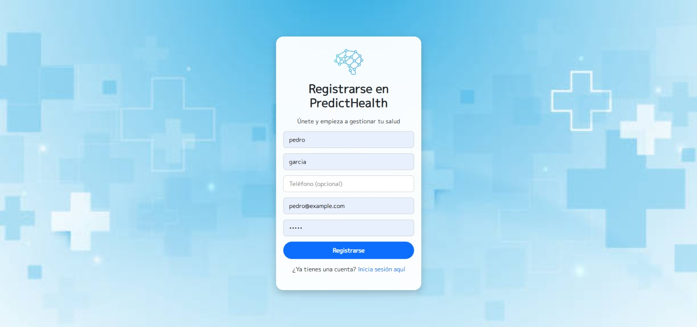
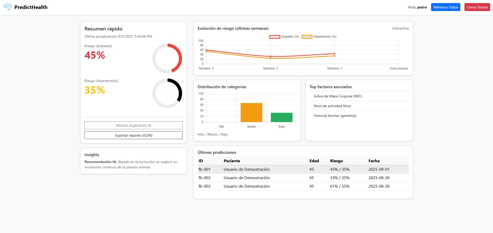
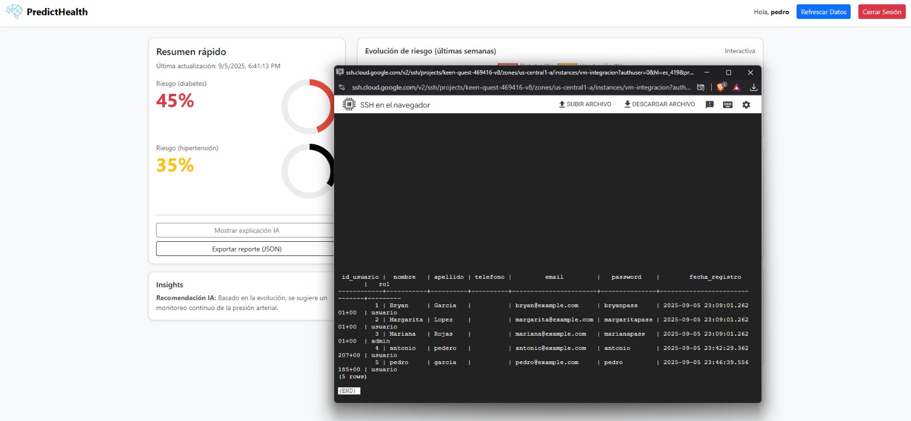

# PredictHealth 🏥

Una plataforma innovadora que aprovecha la inteligencia artificial para predecir el riesgo de enfermedades crónicas, como la diabetes y la hipertensión, y ofrecer recomendaciones preventivas personalizadas, empoderando a los usuarios en la gestión proactiva de su salud.

## 📋 Características Principales

PredictHealth es un ecosistema digital diseñado para la prevención y el bienestar, ofreciendo las siguientes funcionalidades clave:

*   **Detección Temprana y Predicción de Riesgos:** Utiliza modelos de Machine Learning para analizar datos de salud del usuario y clasificar el riesgo de desarrollar diabetes e hipertensión en niveles "Bajo", "Medio" o "Alto", incluso con años de antelación, sin depender de muestras clínicas. La IA puede anticipar el riesgo con hasta 20 años de antelación usando datos genéticos, clínicos y de estilo de vida.
*   **Recomendaciones Personalizadas:** Genera sugerencias específicas y accionables sobre dieta, actividad física y patrones de sueño, adaptadas dinámicamente al perfil de riesgo y hábitos del usuario para promover un estilo de vida más saludable.
*   **Empoderamiento del Usuario:** Proporciona información fácil de entender y herramientas para que los usuarios gestionen activamente su bienestar y tomen decisiones informadas sobre su salud. La simplicidad en la traducción de datos complejos a información comprensible es clave.
*   **Visualización y Seguimiento del Progreso:** Ofrece paneles y gráficos intuitivos en la aplicación móvil y la página web para monitorear la evolución del riesgo y el cumplimiento de las recomendaciones.
*   **Gestión Integral del Perfil de Salud:** Permite actualizar información personal y demográfica (altura, peso, IMC), registrar hábitos de vida (tabaquismo, consumo de alcohol), historial médico auto-informado (condiciones preexistentes, alergias, medicamentos) y antecedentes familiares de enfermedades.
*   **Ingreso de Medidas de Salud:** Facilita el registro periódico de presión arterial y glucosa.
*   **Notificaciones y Recordatorios:** Envía alertas básicas para el registro de datos y la adherencia a los hábitos saludables.
*   **Sincronización en Tiempo Real:** Utiliza Firebase para comunicar instantáneamente información crítica a los usuarios, como alertas de riesgo o actualizaciones de estado.

## 🏗 Arquitectura Tecnológica

PredictHealth se basa en una arquitectura de microservicios moderna y escalable, con las siguientes tecnologías clave:

*   **Backend y Microservicios:**
    *   **Flask:** Para la lógica de negocio estándar.
    *   **FastAPI:** Para microservicios de alto rendimiento, incluyendo el motor de inferencia de ML y MLOps.
*   **Estrategia de Datos (Persistencia Políglota):**
    *   **PostgreSQL:** Fuente de verdad para todos los datos maestros y transaccionales críticos del sistema (perfiles de usuario, historial médico, facturación, predicciones, recomendaciones, etc.).
    *   **Firebase (Firestore o Realtime Database):** Para la sincronización de datos en tiempo real con las aplicaciones cliente (Android y web).
    *   **Redis:** Como capa de caché de alto rendimiento para acelerar el acceso a datos frecuentes y como intermediario de mensajes para comunicación asíncrona entre microservicios.
*   **Procesamiento de Datos y Machine Learning:**
    *   **Hadoop:** Implementado para el procesamiento distribuido y clasificación de grandes volúmenes de datos que alimentan los modelos predictivos.
    *   **Python con librerías:** Scikit-Learn, Pandas, NumPy, Plotly, PyCaret para la automatización del pipeline de ML.
    *   **Modelos de ML:** Se utilizan algoritmos como XGBoost y LightGBM, que han demostrado un buen rendimiento en la predicción de riesgos. Para el MVP, se puede empezar con Random Forest o Árboles de decisión.
*   **Frontend:**
    *   **Aplicación nativa para Android (Java):** Interfaz principal para el usuario final.
    *   **Página web complementaria:** Para registro, seguimiento y reportes, con diseño responsivo. La aplicación móvil multiplataforma puede desarrollarse con Flutter.

## 🧩 Componentes Clave (Microservicios)

La plataforma se organiza en 14 microservicios especializados:

1.  **Servicio de Gestión de Usuarios:** Gestiona la información personal y demográfica, el historial médico auto-informado y los antecedentes familiares. Permite el registro de cuenta, la autenticación básica y la gestión de preferencias de comunicación.
2.  **Servicio de Estilo de Vida y Hábitos:** Encargado de gestionar el registro diario o histórico de los hábitos y el estilo de vida del usuario, datos fundamentales para el motor de predicción y las recomendaciones personalizadas.
3.  **Servicio de Gestión de Datos de Sensores y Dispositivos:** Diseñado para la ingesta, almacenamiento, limpieza y normalización de datos biométricos provenientes de dispositivos externos (smartwatches, monitores de glucosa, tensiómetros). En el MVP, esta integración es básica. Utiliza FastAPI para ingesta de datos de alto rendimiento.
4.  **Servicio de Procesamiento y Balanceo de Datos (para ML):** Crucial para el pipeline de Machine Learning, encargándose de la preparación y transformación de grandes volúmenes de datos antes de que sean utilizados para el entrenamiento o la inferencia de modelos.
5.  **Servicio de Inferencia de Predicciones (ML/IA):** El "cerebro" de PredictHealth, que ejecuta los modelos de Machine Learning entrenados (como XGBoost o LightGBM) para calcular riesgos de enfermedades y generar predicciones personalizadas, incluyendo funcionalidades de MLOps para monitoreo, detección de "data drift" y reentrenamiento periódico.
6.  **Servicio de Recomendaciones Personalizadas:** Genera y administra sugerencias accionables sobre dieta, ejercicio y sueño, basadas en las predicciones de riesgo y hábitos de vida del usuario.
7.  **Servicio de Notificaciones:** Alerta al usuario sobre predicciones, recomendaciones, recordatorios y otra información relevante, soportando notificaciones push, email y SMS.
8.  **Servicio de Autenticación y Seguridad:** Gestiona la autenticación de usuarios y la autorización de acceso a los microservicios, asegurando un control de acceso robusto.
9.  **Servicio de Auditoría y Cumplimiento:** Responsable del logging estructurado, trazabilidad de cambios en los datos y auditoría de acciones realizadas por administradores o el sistema, utilizando tablas como `sesiones_usuarios` y `auditoria_sistema`.
10. **Servicio de Gestión Genética (Opcional/Futuro):** Almacenaría, procesaría y analizaría datos genéticos complejos de los usuarios para potenciar la precisión de las predicciones y recomendaciones. Este servicio está contemplado para futuras expansiones y no es parte del MVP inicial.
11. **Microservicio de Facturación:** Gestiona toda la lógica de negocio relacionada con los planes de membresía, suscripciones, precios, facturas y estados de pago, dado el modelo de suscripción SaaS de PredictHealth.
12. **Microservicio de Pasarela de Pago:** Se encarga de todas las interacciones con proveedores de pagos externos (ej., Stripe, PayPal, MercadoPago) para procesar transacciones de manera segura y eficiente, incluyendo validación y manejo de reembolsos.
13. **API Gateway Service:** Actúa como el único punto de entrada para todas las solicitudes de los clientes (aplicación Android y página web), centralizando el tráfico y proporcionando una capa de seguridad y orquestación para los microservicios internos. Realiza enrutamiento, composición de APIs, autenticación/autorización y limitación de tasas (rate limiting), utilizando Nginx como proxy inverso.
14. **Servicio de Sincronización/Exportación de Datos (Firebase):** Asegura la sincronización de datos en tiempo real entre el backend y las aplicaciones cliente (Android y web), extrayendo datos de PostgreSQL y exportándolos a Firebase para mantener la información actualizada y disponible en tiempo real.

## 🧠 Modelado y Entrenamiento de Machine Learning

El motor de IA de PredictHealth se entrena mediante un pipeline riguroso:

*   **El Problema:** La diabetes mellitus (DM) es una de las 10 enfermedades más graves a nivel mundial, con complicaciones progresivas y altos costos de atención. En Colombia, la prevalencia de HTA y DM ha aumentado en los últimos 6 años, con 4.5 millones de casos de HTA y 1.4 millones de DM en 2020. Alrededor del 45% de la población con DM desconoce que la padece, lo que hace crucial un diagnóstico oportuno. Los métodos tradicionales de diagnóstico, que requieren muestras clínicas, son costosos, invasivos y difíciles de implementar en países en desarrollo, especialmente en zonas rurales.
*   **Objetivo de ML:** Aplicar modelos basados en técnicas de aprendizaje automático para apoyar el diagnóstico temprano de la diabetes mellitus, utilizando variables de datos ambientales, sociales, económicos y sanitarios, sin la dependencia de la toma de muestras clínicas.
*   **Datos Necesarios:**
    *   **Variable Objetivo (Label):** Diagnóstico confirmado de diabetes o hipertensión (sí/no) o nivel de riesgo (bajo/medio/alto).
    *   **Variables Predictoras (Features):** Datos demográficos y clínicos básicos (edad, sexo, IMC, antecedentes familiares, presión arterial, glucosa, colesterol, triglicéridos), estilo de vida y hábitos (actividad física, dieta, sueño, estrés/estado de ánimo, consumo de alcohol/tabaco), y biométricos de sensores/wearables (frecuencia cardíaca, presión arterial, glucosa continua, peso/composición corporal). Los datos genéticos se consideran para futuras expansiones.
    *   **Datos Mínimos Viables (MVP):** Edad, sexo, IMC, presión arterial, glucosa, colesterol, hábitos básicos (actividad, dieta, sueño).
*   **Fuentes de Datos:** Se utilizan datasets públicos de salud como NHANES (CDC, EE.UU.) y Framingham Heart Study, así como datos del CDC BRFSS 2023, complementados con los datos de los primeros usuarios de la app.
*   **Pipeline de Entrenamiento (Metodología CRISP-ML(Q)):**
    1.  **Recolección de Datos:** Se han utilizado datos de 10,889 usuarios de Colombia diagnosticados con hipertensión y datasets públicos como NHANES y Framingham Heart Study, junto con BRFSS 2023.
    2.  **Preprocesamiento:** Incluye limpieza, normalización, creación de features derivadas (ej. IMC), codificación de variables categóricas y, crucialmente, el balanceo de clases mediante técnicas como SMOTE, NearMiss, RandomUnderSampler, y SMOTEENN para abordar el desequilibrio en los datos (clase minoritaria de diabetes es del 15.61%). La combinación de SMOTE seguido de NearMiss ha demostrado ser la estrategia más efectiva para este problema.
    3.  **Modelos Iniciales y Selección:** Se exploran modelos supervisados como k vecinos más cercanos (KNN), árboles de decisión (DT), bosques aleatorios (RF). Para el MVP, se priorizan Random Forest o Árboles de Decisión. Se utilizan herramientas como PyCaret para automatizar la construcción y comparación de modelos.
    4.  **Optimización de Hiperparámetros:** Se utilizó la técnica de búsqueda por grilla (Grid Search) para optimizar hiperparámetros de KNN, DT y RF.
    5.  **Ensamble de Algoritmos:** Se evalúan métodos de ensamble como votación, bagging y boosting (Gradient Boosting, XGBoost) para mejorar la generalización de las predicciones. XGBoost obtuvo el valor AUC-ROC ligeramente más alto (0.6092) en un estudio.
    6.  **Entrenamiento y Validación:** Los datos se dividen para entrenamiento (70-80%), validación (15%) y prueba (15-20%).
    7.  **Métricas Clave:** Se evalúa el rendimiento utilizando AUC-ROC, precisión, recall (sensibilidad), especificidad y F1-score. La sensibilidad es de gran importancia para detectar pacientes con mayor probabilidad de desarrollar DM.
    8.  **MLOps:** Un aspecto fundamental es el monitoreo continuo del modelo en producción, el reentrenamiento periódico con nuevos datos de usuario y la detección de "data drift".
*   **Modelo Seleccionado:** Un estudio de implementación ha seleccionado el XGBClassifier entrenado sobre datos remuestreados con SMOTEENN debido a su mínimo sobreajuste, sensibilidad equilibrada y robusta generalización, y eficiencia práctica.

## 📊 Estructura de Datos (PostgreSQL)

La base de datos PostgreSQL actúa como la fuente de verdad y está diseñada para manejar de manera eficiente la información de salud de los usuarios:

*   **`usuarios`**: Información fundamental de la cuenta (id, nombre, apellido, email, fecha de nacimiento, género, contraseña_hash, preferencias de comunicación).
*   **`perfil_salud_general`**: Información de salud estática (altura, peso, IMC, si es fumador, consumo de alcohol, condiciones preexistentes, alergias, medicamentos, discapacidad).
*   **`historial_familiar`**: Registra predisposiciones familiares a enfermedades (parentesco, enfermedad_relacionada, edad_diagnostico_familiar).
*   **`actividad_fisica`**: Detalles de la actividad física diaria (tipo, duración, frecuencia, pasos, fuente).
*   **`dieta`**: Hábitos alimenticios (patrones, consumo de frutas/verduras, sal, azúcar, agua, calorías estimadas).
*   **`sueno`**: Patrones de sueño (horas, calidad).
*   **`estado_animo_estres`**: Nivel de estrés y estado de ánimo.
*   **`datos_sensores`**: Medidas biométricas de dispositivos externos (frecuencia cardíaca, presión arterial, glucosa en sangre, unidad, dispositivo_fuente).
*   **`predicciones_ml`**: Resultados de las predicciones de riesgo generadas por ML (tipo_riesgo, puntuacion_riesgo, nivel_riesgo, factores_influyentes, modelo_version, estado_prediccion).
*   **`recomendaciones_usuario`**: Consejos y acciones sugeridas al usuario (categoría, título, contenido_es, prioridad, estado_recomendacion, feedback_usuario).
*   **`notificaciones_usuario`**: Registros de notificaciones enviadas (tipo_notificacion, mensaje_es, leida, url_accion).
*   **`sesiones_usuarios`**: Registro para fines de auditoría y seguridad de las sesiones de usuario.
*   **`auditoria_sistema`**: Registro detallado de eventos y acciones para trazabilidad y cumplimiento.
*   **`planes_membresia`**: Información de los planes de suscripción ofrecidos.
*   **`suscripciones_usuarios`**: Gestión de los periodos de suscripción de los usuarios y sus renovaciones.
*   **`facturas`**: Registros de facturación (id, id_suscripcion, fecha_factura, monto_total, impuestos, monto_neto, estado_pago, fecha_vencimiento, metodo_pago, url_factura_pdf).
*   **`proveedores_pago`**: Registra los proveedores de servicios de pasarela de pago externos (ej., Stripe, PayPal, MercadoPago).
*   **`informacion_genetica` (futuro)**: Resultados de análisis genéticos y predisposiciones para potenciar la precisión.

## 🌟 Propuesta de Valor

PredictHealth ofrece un valor diferenciado a través de:

*   **Proactividad:** Permite actuar antes de la manifestación de los síntomas, enfocándose en la prevención de enfermedades crónicas.
*   **Personalización:** Proporciona recomendaciones y un mapa de riesgo adaptados al estilo de vida y perfil de salud individual de cada usuario.
*   **Empoderamiento:** Transforma al usuario en un gestor activo de su propia salud, brindándole información y herramientas para tomar decisiones informadas.
*   **Simplicidad:** Traduce datos complejos de salud en información comprensible y pasos accionables, clasificando el riesgo de manera clara y sencilla.

## 🎨 Consideraciones de Diseño UX/UI

El diseño de PredictHealth se centra en el usuario y busca crear una experiencia óptima y segura en el ámbito de la salud:

*   **Usabilidad y Simplicidad:** La interfaz será intuitiva, con navegación clara y botones fácilmente identificables, evitando la confusión y los errores. Se utilizan diseños limpios con jerarquía visual, espaciado adecuado y consistencia. La carga cognitiva se reduce minimizando elementos distractores y optimizando flujos de trabajo.
*   **Accesibilidad:** Es esencial que la aplicación sea accesible para todos los usuarios, incluyendo aquellos con discapacidades, con opciones de ajuste de texto y contraste. Se seguirán estándares como las Pautas de Accesibilidad al Contenido en la Web (WCAG).
*   **Seguridad y Transparencia de Datos:** Dado que la información de salud es altamente confidencial, el diseño garantiza la protección de datos mediante cifrado, acceso seguro y una comunicación clara sobre la recopilación y uso de la información.
*   **Comunicación Eficaz:** Se emplea un lenguaje claro y sencillo, evitando la jerga médica, y se utilizan ayudas visuales como gráficos e infografías para comunicar información compleja de forma comprensible. El UX Writing usará un tono empático y positivo.
*   **Personalización y Motivación:** La IA y el Machine Learning permiten personalizar automáticamente la interfaz y ofrecer sugerencias y alertas proactivas basadas en el historial del usuario. Se implementarán microinteracciones que motiven y feedback positivo.
*   **Diseño Centrado en Tareas Críticas:** Las funciones clave, como el registro de niveles de glucosa, son rápidamente accesibles y fáciles de usar, priorizando los flujos de trabajo esenciales.
*   **Diseño Responsivo:** La aplicación se adapta óptimamente a diferentes tamaños de pantalla y dispositivos, garantizando una experiencia coherente y fluida.
*   **Estética Visual:** Se inclinan por paletas de colores suaves, enriquecidos y degradados, que son más cómodos visualmente y pueden indicar si el contenido fue generado por IA para promover transparencia.

## 🚫 Exclusiones del MVP y Futuras Expansiones

### Exclusiones del MVP:

*   **Diagnóstico Clínico Formal:** PredictHealth no proporcionará un diagnóstico clínico formal ni sustituirá la consulta médica.
*   **Interacción Directa con Profesionales Médicos:** En su fase inicial, no incluirá interacción directa con médicos u hospitales en el frontend principal.
*   **Cobertura de Enfermedades:** La plataforma se limita a la prevención y predicción de diabetes e hipertensión.
*   **Integración Compleja con Wearables:** La integración con dispositivos portátiles y avanzados será básica en el MVP, con planes de expansión futura.
*   **Datos Genéticos:** El procesamiento y análisis de biomarcadores genéticos no se incluirá en el MVP, pero se considera un pilar fundamental a mediano y largo plazo para una medicina predictiva más precisa.
*   **Simulación Avanzada:** No incluirá simulaciones avanzadas con tecnologías como LeapMotion.

### Futuras Expansiones:

*   **Integración Profunda con Wearables y Dispositivos Médicos:** Mayor interoperabilidad con una variedad de sensores y dispositivos.
*   **Notificaciones Push:** Para alertas críticas y recordatorios más efectivos.
*   **Análisis Avanzado de Tendencias:** Para proporcionar insights más profundos sobre la evolución de la salud del usuario.
*   **Integración con Sistemas de Salud Existentes:** Conexión con hospitales y clínicas para un enfoque más colaborativo en la atención.
*   **Modelos de IA más Avanzados:** Uso de Redes Neuronales para una mayor personalización y precisión predictiva.
*   **Nutrigenética:** Análisis de variantes genéticas para desarrollar modelos predictivos de riesgo de obesidad y patologías asociadas, y comprender la respuesta del cuerpo a dietas y ejercicios.

## 🚀 Instalación y Configuración (Guía General)

### Prerrequisitos:

*   Python 3.x
*   PostgreSQL
*   pip (gestor de paquetes de Python)

### Instalación:

1.  **Clonar el repositorio** (Si el proyecto fuera de código abierto)
    ```bash
    git clone https://github.com/tu-usuario/PredictHealth.git
    cd PredictHealth
    ```
2.  **Crear y activar un entorno virtual**
    ```bash
    python -m venv venv
    source venv/bin/activate  # En Linux/macOS
    # venv\Scripts\activate   # En Windows
    ```
3.  **Instalar dependencias**
    ```bash
    pip install -r requirements.txt
    ```
4.  **Configurar base de datos PostgreSQL**
    *   Crear una base de datos PostgreSQL.
    *   Configurar las credenciales de la base de datos en las variables de entorno o archivo de configuración del proyecto.
5.  **Configurar variables de entorno** (opcional)
    *   Crear un archivo `.env` en la raíz del proyecto y añadir las variables necesarias (ej., `DATABASE_URL`, `SECRET_KEY`).

### Ejecución:

*   La aplicación del backend estará disponible en `http://localhost:5000` (o el puerto configurado).

## 👥 Usuarios de Prueba (Ejemplo)

El sistema puede incluir datos de prueba con los siguientes roles:

*   **Usuario Regular**
    *   Email: `bryan@example.com`
    *   Contraseña: `bryanpass`
*   **Usuario Regular**
    *   Email: `margarita@example.com`
    *   Contraseña: `margaritapass`
*   **Administrador**
    *   Email: `mariana@example.com`
    *   Contraseña: `marianapass`

## ⚠️ Consideraciones de Seguridad (Importante)

**ATENCIÓN**: Esta es una versión de prototipo y, como tal, puede incluir vulnerabilidades conocidas como contraseñas almacenadas en texto plano, falta de validación robusta de entrada, sin protección CSRF y sin limitación de tasas de solicitud (rate limiting).
**NO utilizar en producción sin implementar las medidas de seguridad apropiadas y realizar una auditoría de seguridad exhaustiva.**

## 📝 Licencia

Este proyecto está bajo la Licencia MIT - ver el archivo `LICENSE.md` para más detalles.

## 📸 Screenshots

### Registro de Usuario
*Interfaz de registro con diseño limpio y moderno*


### Dashboard Principal
*Dashboard interactivo con métricas de salud, gráficos dinámicos y predicciones de riesgo*


### Base de Datos
*Vista de la base de datos PostgreSQL con usuarios registrados*


⚕️ **Desarrollado con el objetivo de mejorar el acceso a la información de salud predictiva**
